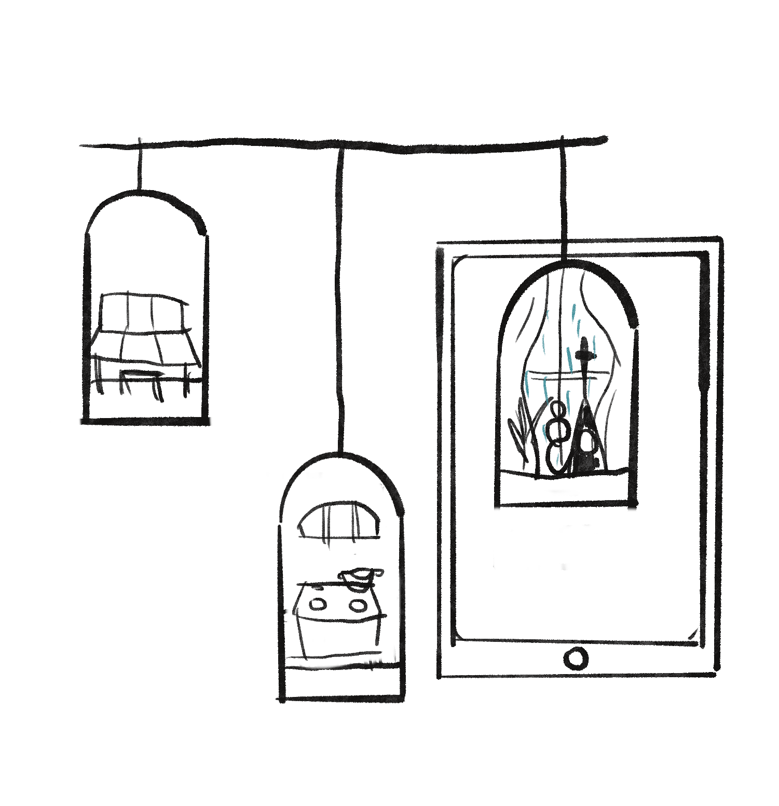
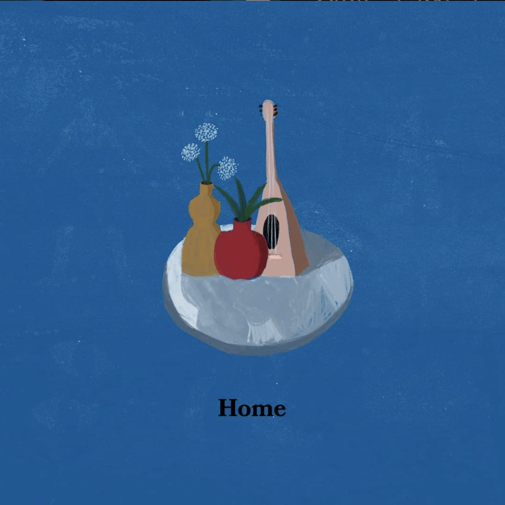
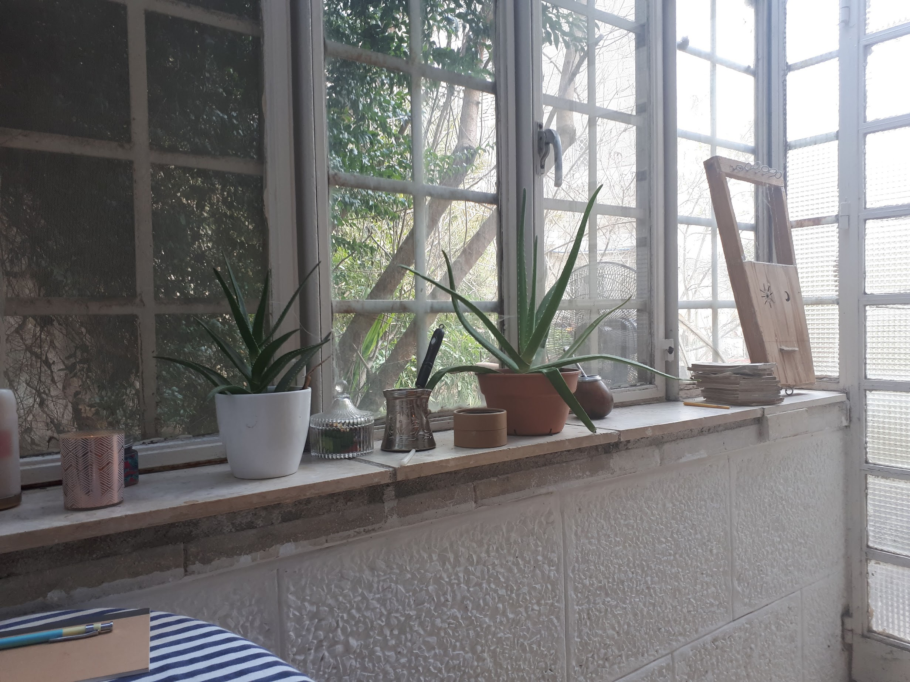
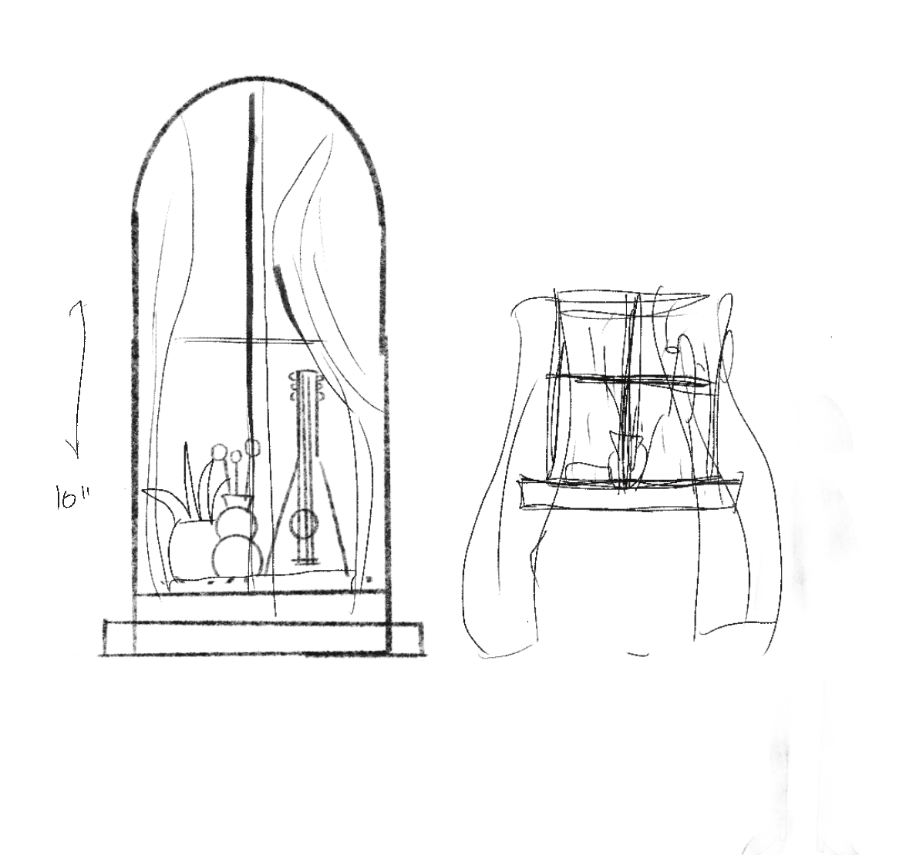
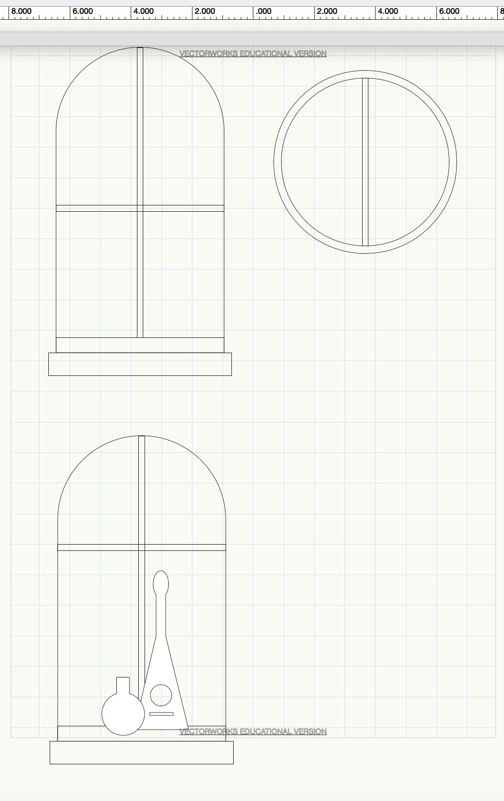

# Digital-Fabrication

This week I continued to read about the consept of memory palace. When thinking about which images I want to incoporate, I felt like going into my own memory would be the best route. I wanted to cupture the collective memories that are ingrained in me- memories of my family, my ancestor, my city.

After a work meeting with Stuti, we decided to make this memory palace come to life by adding a sound AR expreince to it. The glass dome would be arrange in a structre (tbd). The visitor will have an ipad, and when viewing the minuatre, a sound of the place represented in the miniature will be played. We hope that this expreince could enhance the feeling of capturing memory and plave via objects.

For now, I want to focus on one image, of the window in my apartment in Jerusalem. Me and my husband spent four years together in this very small apartment, but due to the windows it never felt too small. Once we got married, we had to leave the apartment- I moved to Brooklyn and my husband to Tel Aviv. 

Sketch in progress:

